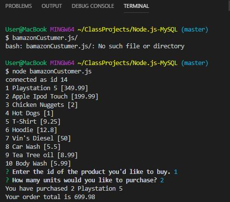

# Node.js-MySQL

## Challenge 1: Bamazon
My goal is to make an interface that works swhere user buys items based on what they see in the catalogue using node based client. 
To do this it must be connected to MySQL database to constantly update

## Deployment

1.  Clone the repo
2.  npm install in terminal
3.  Access a terminal or cammand prompt
4.  cd Node.js-MySQL * (or folder containing repo code and required files) *
5.  In node bamazonCustomer.js
6.  Run client and follow prompt

## Tech  

* jQuery
* Node.js 
* MySQL 

